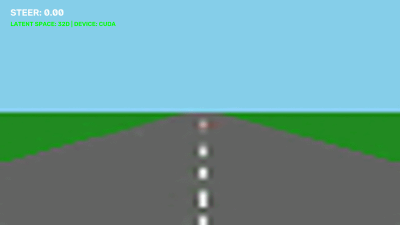

The input frame is compressed by the VAE into the latent representation z. The MDN-RNN then uses latent z, the current action, and its hidden memory of previous frames to predict the next state. It gives outcome as a probability distribution, from which we sample the next z. The VAE decoder turns z back into a frame, and the frames are then used to generate the video.

